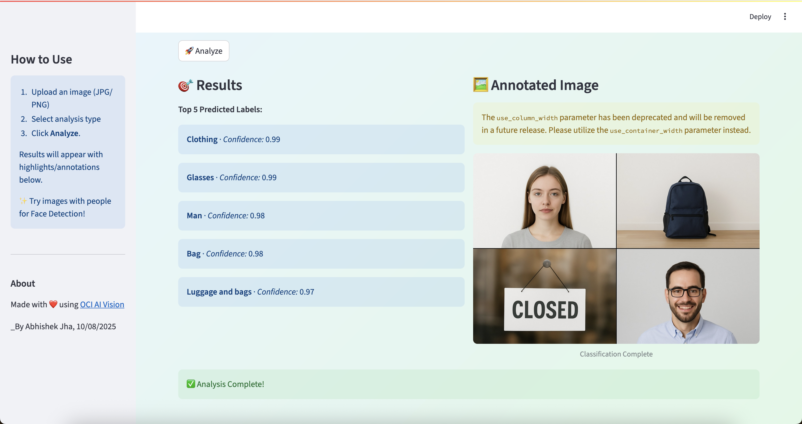
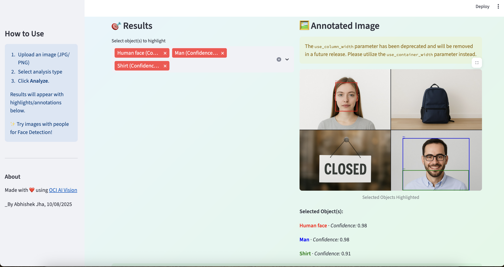
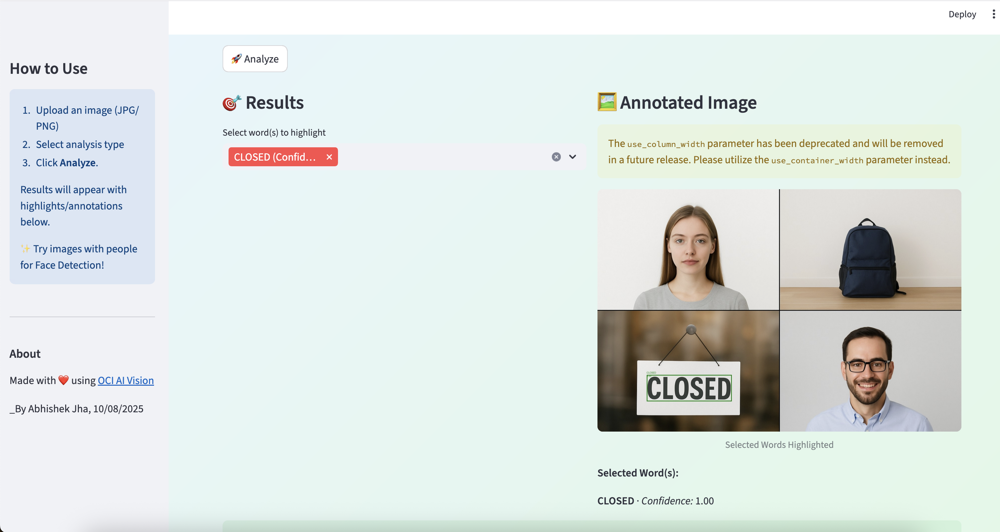
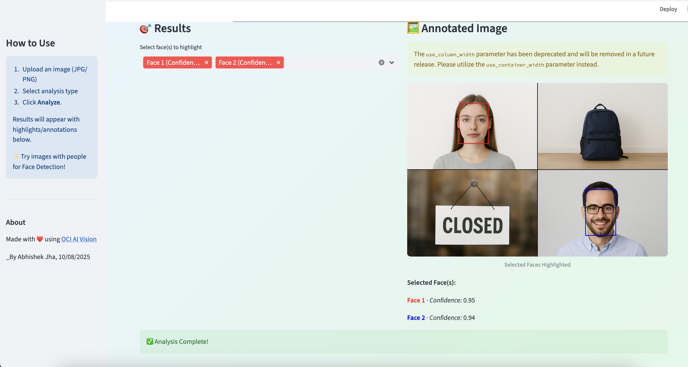

# Smart Image Analyzer Dashboard

A visual, interactive dashboard for running advanced image analytics using [Oracle Cloud Infrastructure (OCI) Vision AI](https://docs.oracle.com/en-us/iaas/Content/ai-vision/home.htm). Instantly analyze images for objects, text, and faces—with intuitive, color-coded annotations for every result!

## ✨ Features

- **Drag-and-drop Image Upload**: PNG and JPEG supported.
- **Accessible Analysis Types**:
  - **Image Classification**: See top-5 predicted categories.
  - **Object Detection**: Identify and color-highlight multiple detected objects.
  - **Text Extraction**: OCR with bounding boxes and text confidence.
  - **Face Detection**: Colorful face outlines, confidence, and landmarks.
- **Interactive Multiselect Results**: Choose which results to highlight, view multiple at once.
- **Colorful Visualizations**: Each box and corresponding label gets a unique color for clarity.
- **Fast & Efficient**: Results are cached after each analysis for a snappy user experience.
- **Instant Feedback**: Balloons and messages confirm successful analysis.

## 📸 Screenshots

### Image Classification

<p align="center">
  
</p>

### Object Detection
<p align="center">
  
</p>

### Text Detection
<p align="center">
  
</p>

### Face Detection
<p align="center">
  
</p>

## 🚀 Getting Started

1. **Clone this repo**

    ```bash
    git clone https://github.com/yourusername/smart-image-analyzer.git
    cd smart-image-analyzer
    ```

2. **Install dependencies**
    ```bash
    pip install streamlit oci pillow
    ```

3. **Configure OCI**
    - Place your `config` file in the root directory (see [OCI config docs](https://docs.oracle.com/en-us/iaas/Content/API/SDKDocs/pythonsdkconfig.htm)).
    - Update `compartment_id` in `app.py` with your compartment’s OCID.

4. **Run the app**
    ```bash
    streamlit run app.py
    ```

5. **Use your browser**  
    - Go to `http://localhost:8501`
    - Upload a photo, select your desired analysis, and click **Analyze**!

## 🧩 Customization

- **Colors**: Tweak the `ANNOTATE_COLORS` list in the script for your palette.
- **Default Choices**: Change the multiselect defaults as you wish.
- **Use other OCI Vision features**: See the [OCI Vision documentation](https://docs.oracle.com/en-us/iaas/Content/ai-vision/home.htm) for more.

## 🤝 Contributing

Pull requests are welcome! For feedback, issues, or questions, open a [GitHub Issue](https://github.com/yourusername/smart-image-analyzer/issues).

## © License

[MIT License](LICENSE)

---

Made with ❤️ using [Oracle Cloud AI Vision](https://docs.oracle.com/en-us/iaas/Content/ai-vision/home.htm)  
_By Abhishek Jha, 2025_10th August
